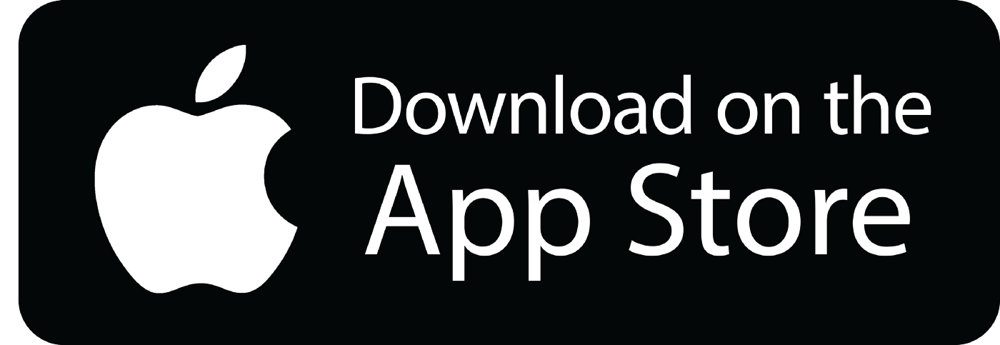

## The Aware App - #ABetterYou

An app that helps you connect with your family and friends to better understand where you are doing well and what are areas of development.

You ultimately get to decide what to work on. Getting an external perspective from people who want nothing but the best for you will help see what you may chose to ignore.

Work towards #ABetterYou - focus on yourself, prioritize yourself, grow yourself.

    

    

        <h2 class="heading-2 video">Learn more about Aware.</h2>
     

       <iframe width="560" height="315" src="https://www.youtube.com/embed/GvNaq5lhesE" frameborder="0" allow="accelerometer; autoplay; clipboard-write; encrypted-media; gyroscope; picture-in-picture" allowfullscreen></iframe>
        

   

   

    
    
Download Aware from:

                                                                  
    

Questions/Comments: <a href="mailto:theawareapp@gmail.com">Email Us!</a>
